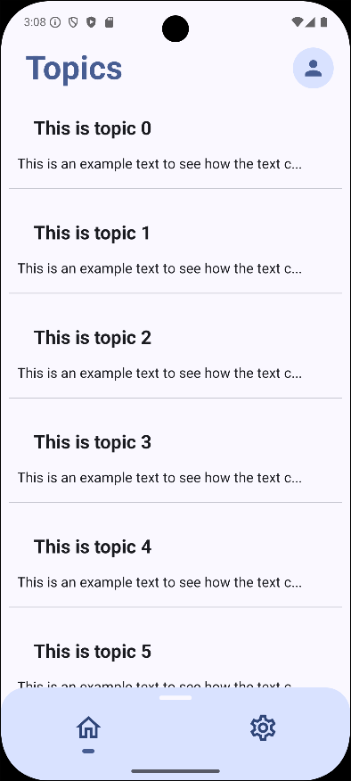
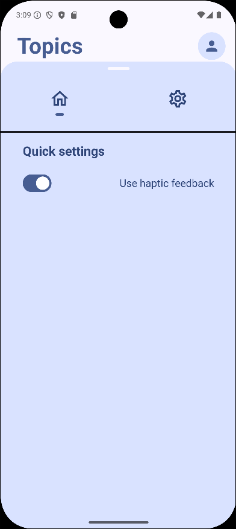
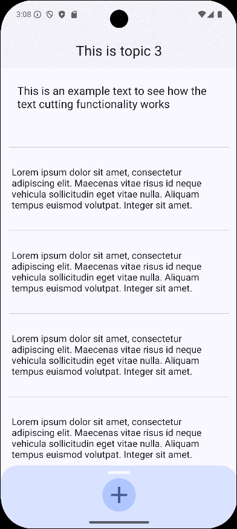

# 📱 Topics

**Topics** is an Android application inspired by platforms like **X (formerly Twitter)** and **Reddit** — but currently, only the **UI layer** is implemented.

---

## 🚧 Status

> **Note:** This is an early-stage project. For now there is only a part of UI working and there is **no backend or functional logic yet**.

---

## ✨ Features

- 📱 Modern UI built entirely with **Jetpack Compose**
- 💉 Dependency Injection powered by **Koin**
- 🌫️ Smooth blur effects using the **Haze** library
- ⚡ Clean architecture foundation in place for future functionality

---

## 🛠️ Tech Stack

| Tech | Purpose |
|------|---------|
| [Jetpack Compose](https://developer.android.com/jetpack/compose) | Declarative UI toolkit for modern Android apps |
| [Koin](https://insert-koin.io/) | Lightweight dependency injection |
| [Haze](https://github.com/chrisbanes/haze) | Easy blur effect implementation |

---

## 📷 Screenshots

### 🏠 Home Screen

### 🏠 Home Screen

### 📝 Topic Details Screen

---

## 🚀 Getting Started

1. Clone the repo
2. Open in **Android Studio**
3. Run the app on your emulator or device

---

## 📌 Roadmap

- [ ] Implement backend integration
- [ ] Add authentication & profiles
- [ ] Enable posting, commenting, and voting
- [ ] Notifications & real-time updates

---

## 📄 License

MIT License – see the [LICENSE](LICENSE) file for details.
